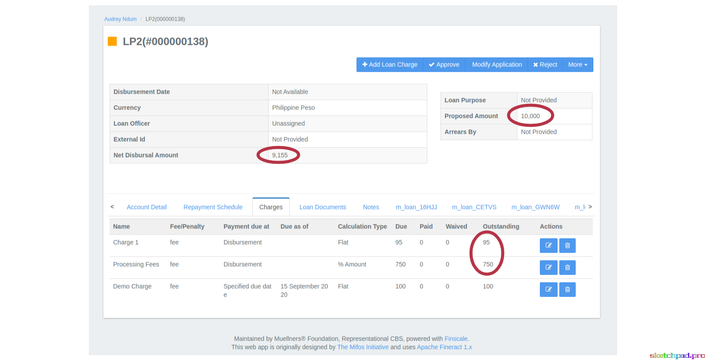
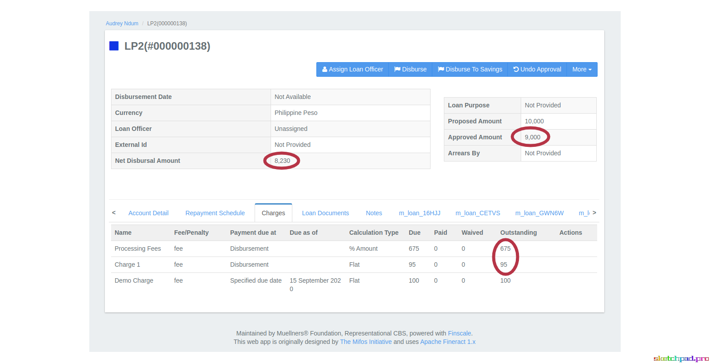
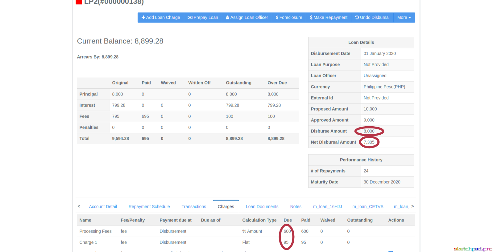
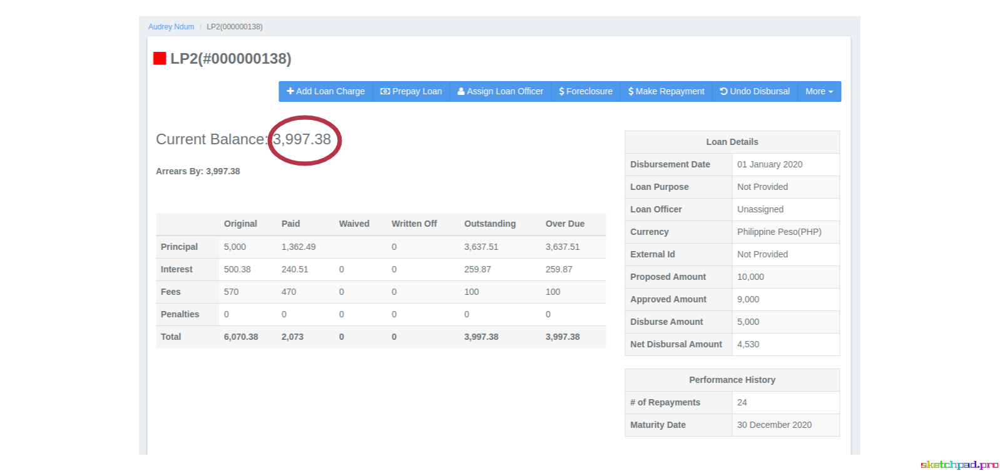
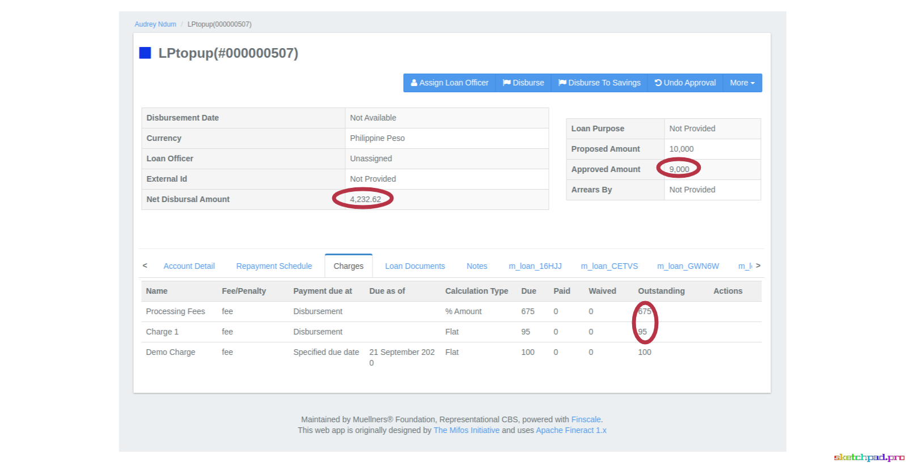
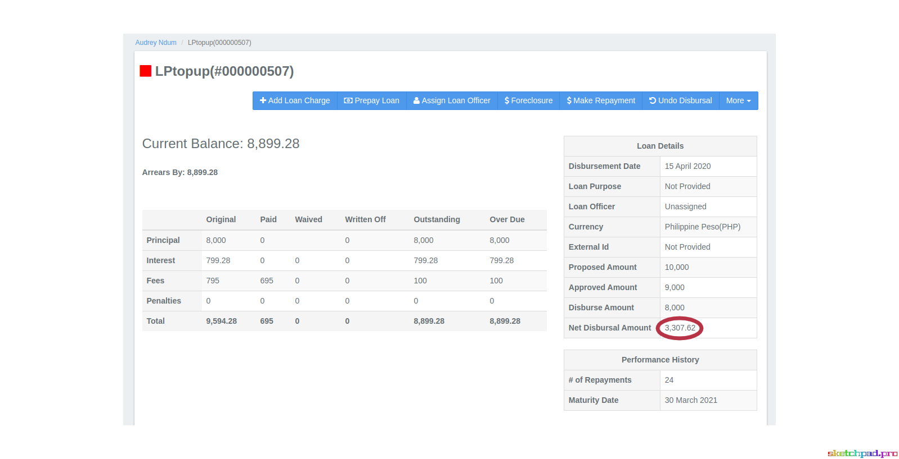

## `Adding Net Disbursal Amount logic to different Loan Lifecycle Events`

_Net Disbursal Amount (NDA) represents the actual loan amount disbursed void of any fees or costs of the financial transactions. I worked on implementing this feature at certain event states of a loan’s lifecycle, for two loan categories - regular loans and refinanced loans._

NDA is an attribute included and recalculated with respect to certain events (Approval, Disbursal, Approval Reversal, Disbursal Reversal) of a loan lifecycle and is based on the loan amount at varying points of this cycle. This calculation is done for regular loans, but enhanced for refinanced loans by taking into consideration the topup amount of the previous loan to be closed.

## 1. Loan lifecycle event states:
- Pre-Approval
- Post-Approval
- Post-Disbursal
- Disbursal Reversal
- Approval Reversal

## 2. Use Case 1: Regular Loan
Consider the following scenario:
A loan application is submitted with a proposed amount of 10,000 units. Assuming there are two charges -
* charge 1 - fee due at disbursement which is a flat amount of 95
* charge 2 - fee due at disbursement which is 7.5% of the loan amount

### A. Pre-Approval
This signifies the Net Disbursal Amount calculated with respect to the proposed loan amount for the loan application. This implies that:

NDA = Proposed Amount - Charges at Disbursal

Considering the scenario mentioned above and assuming the amount proposed was 10,000 units the net disbursal amount will be calculated as follows:
NDA = 10,000 - (95 + 750) = 9155

### B. Post-Approval
Here, the Net Disbursal Amount is calculated with respect to the approved loan amount for the loan. This implies that:

NDA = Approved Amount - Charges at Disbursal

Considering the scenario mentioned above and assuming the amount approved was 9,000 units the net disbursal amount will be calculated as follows:
NDA = 9,000 - (95 + 675) = 8230

### C. Post-Disbursal
This signifies the Net Disbursal Amount is calculated with respect to the disbursed loan amount for the loan. This implies that:

NDA = Disbursed Amount - Charges at Disbursal

Considering the scenario mentioned above and assuming the amount disbursed was 8,000 units the net disbursal amount will be calculated as follows:
NDA = 8,000 - (95 + 600) = 7305

### D. Disbursal Reversal
After disbursal of the loan is reversed, the Net Disbursal Amount is calculated with respect to the approved loan amount. This implies that:

NDA = Approved Amount - Charges at Disbursal

Considering the scenario mentioned above and assuming the amount disbursed was 8,000 units the net disbursal amount will be calculated as follows:

NDA = 9,000 - (95 + 675) = 8230

### E. Approval Reversal
After approval of the loan is reversed, the Net Disbursal Amount is calculated with respect to the proposed loan amount. This implies that

NDA = Proposed Amount - Charges at Disbursal

Considering the scenario mentioned above, the amount proposed was 10,000 units the net disbursal amount will be calculated as follows:

NDA = 10,000 - (95 + 750) = 9155

## 3. Use Case 2: Refinanced Loan
Consider the following scenario:

A loan application is submitted with a proposed amount of 10,000 units. Assuming there are two charges -
* charge 1 - fee due at disbursement which is a flat amount of 95
* charge 2 - fee due at disbursement which is 7.5% of the loan amount

Also, the topup balance of the previous loan to be closed is 3997.38 units.

### A. Pre-Approval
This signifies the Net Disbursal Amount calculated with respect to the proposed loan amount for the loan application. This implies that:

NDA = Proposed Amount - Charges at Disbursal

Considering the scenario mentioned above and assuming the amount proposed was 10,000 units the net disbursal amount will be calculated as follows:
NDA = 10,000 - (95 + 750) = 9155

### B. Post-Approval
Here, the Net Disbursal Amount is calculated with respect to the approved loan amount for the loan. This implies that:

NDA = Approved Amount - Charges at Disbursal - Topup Balance

Considering the scenario mentioned above and assuming the amount approved was 9,000 units the net disbursal amount will be calculated as follows:
NDA = 9,000 - (95 + 675) - 3997.38 = 4232.62

_**Figure 1:** Previous Loan To Close (With Topup Balance)_

_**Figure 2:** Refinanced Loan Approved_

### C. Post-Disbursal
Here, the Net Disbursal Amount is calculated with respect to the disbursed loan amount for the loan. This implies that:

NDA = Disbursed Amount - Charges at Disbursal - Topup Balance

Considering the scenario mentioned above and assuming the amount disbursed was 8,000 units the net disbursal amount will be calculated as follows:
NDA = 8,000 - (95 + 600) - 3997.38 = 3307.62

### D. Disbursal Reversal
Disbursal of a refinanced loan cannot currently be reversed. Hence, you will see an error implying that undoing disbursal for a topup loan is not allowed.

### E. Approval Reversal
If a refinanced loan hasn’t yet been disbursed, undoing approval of the loan is possible. After undoing the approval action, the Net Disbursal Amount is calculated with respect to the proposed loan amount. This implies that

NDA = Proposed Amount - Charges at Disbursal - Topup Balance

Considering the scenario mentioned above, the amount proposed was 10,000 units the net disbursal amount will be calculated as follows:
NDA = 10,000 - (95 + 750) = 9155

_You can see from the above that the net disbursal amount feature varies for a loan based on whether it’s a regular or refinanced loan, and also based on the current event of its lifecycle._

## 4. Code Level Changes

### A. Methods Affected
* **approveApplication** in LoanApplicationWritePlatformServiceJpaRepositoryImpl class
* **undoApplicationApproval** in LoanApplicationWritePlatformServiceJpaRepositoryImpl class
* **undoLoanDisbursal** in LoanWritePlatformServiceJpaRepositoryImpl class
* **fetchDisbursementData** in LoanUtilsService
* **toData** in LoanTransaction class

### B. Database Tables
* **File Added:** V367__loan_net_disbursal_amount.sql
* **Tables modified:**
  * Added column `net_disbursal_amount` to table `m_loan`.
  * Added column `net_disbursal_amount` to table `m_loan_disbursement_detail`.
  
I hope you enjoyed this guide. Feel free to write to us or join.
