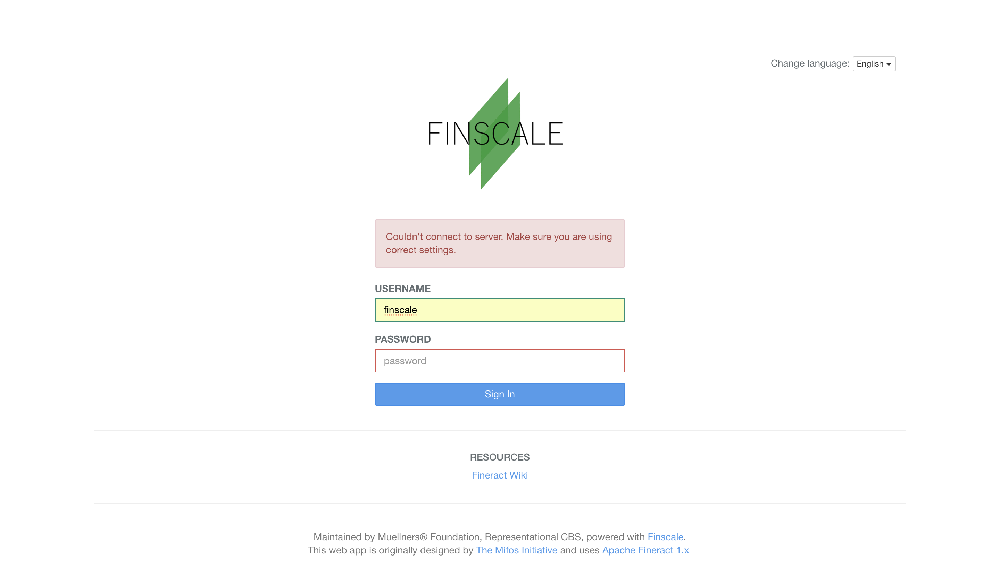
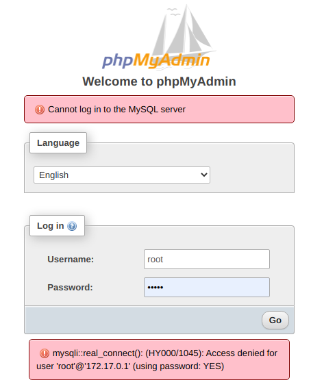

_I worked on a public deployment instance of Apache Fineract and stabilized this deployment for a month. During this time, I faced a lot of issues.
With this blog, I have tried my best to confront them and highlight what are the possible reasons these issues exist and what are ways to navigate through them when you are working with Fineract 1.x_

**Reference Derivative Documentation:** https://docs.fineract.net

We are using following repositories as reference forks of Apache Fineract 1.x:

###A. Fineract 1.x / Server/ Backend
**Github Link:**

https://github.com/muellners/fineract

**Deployment Types Available:**
* Docker
* Kubernetes

###B. Run integration test
**Github Link:**

https://github.com/muellners/fineract/blob/develop/.travis.yml

You can refer to the travis build support file;

Usual steps provided are:
* Create a test build
* Generate a fresh build and check compile

###C. Once the integration tests are complete
Deploy services

###D. Fineract Client side (Mifos X Client) community app
**Source Code (develop branch):**
* https://github.com/muellners/community-app

###E. Similar process for jenkins follows
This app is written in angular JS, need to build and deploy the solution in static server through Apache server or any server that can process JS can be used.

**Deployment Types Available:**
* Docker

**Deploy services using grunt build**
____________________________________________________________________

###Relevant Documentation:
* https://research.muellners.org/end-to-end-deployment-of-fineract/

* https://research.muellners.org/setting-up-fineract-end-to-end/

###Understand Github Workflow:
* https://guides.github.com/introduction/flow/

##A Few Deployment Concerns / Important Notes
###A. Timezone Tenant Configuration:
Each date in a loan schedule, loan product date definitions may jump one date back or more if the Time Zone of the Tenant is not properly set up.

**Possible Diagnosis:**
* Time zone differences.
* Rebase of upstream code base of Apache Fineract.

**Possible Occurrence:**

This error is due to a system wide configuration, so every date in the system is likely affected. This occurs due to a timezone offset, so you might notice this on loan product dates or repayment schedules after just installing the system.

**Possible Solution Path:**

You need to set the tenant timezone accordingly in the tenants database. It's a required configuration. The only feasible solution is to set up your tenant timezone configuration accordingly with the hosted environment of your deployment; local or remote.
You can set it to UTC preferably. This can be done by following the steps below:
* Log into your database
* Go to the fineract_tenants.tenants table.
* Change the timezone_id from “Asia/Kolkata” which is the default to “UTC” for all tenants.

You can do this easily using a mysql management GUI tool like phpMyAdmin but if you prefer using the terminal to do so and are running mysql in a container, the following steps which are just a more detailed explanation of those listed above should suffice:

1. Log into mysql database.

Then, enter the password for the root user and you should be logged in.

Here, _“mysql-5.7”_ is the name of my mysql container, and I’m using the _“root”_ user to login.

2. Switch to tenants table

3. Change timezone

This changes the timezone_id for all tenants to _“UTC”_.
____________________________________________________________________

###B. Connection to Server Settings: Proper Settings
Occasionally, you might come across this “connection to server issue” on the community app when attempting to log in. From my experience, this usually occurs when there is an issue with the database or when Fineract 1.x is unable to establish a proper connection with the database or make queries accordingly. I’ve tried to document as many potential causes and how to possibly solve them.

####1. MySQL Packet Size Error
   
**Possible Diagnosis:**

   Fineract 1.x’s database got a packet(data sent from backend to mysql database for a specific query) got bigger than maximum allowed. As a result of this, a community app user could not login. The user finds _“Connection to server error”_. This happens because the maximum allowed packet value permitted by the mysql server is 4MB by default which is too small to handle certain queries.
   
**Possible Occurrence:**

   I came across this once while trying to log into Fineract 1.x via the Community App, you probably will too. There might be other requests made that cause this issue to popup but whatever the case, possible resolutions are defined below.
   
**Possible Solution Path:**

   You would have to increase the maximum allowed packet value for the mysql database to 67MB or more if the server is required to handle larger queries.
1. **Option 1 (preferred)**
   
   Login to mysql and change the “max allowed packet” for every user to 67MB (67108864 bytes) until the server restarts. This value can be increased up to 1GB, but will reset if the mysql server restarts, even if you set it globally.

2. **Option 2**

Remove the mysql docker container. Note that doing this deletes all databases in that container.

Create a new container, passing the following flag “--max-allowed-packet=67108864”

__________________________________________________________________________

####2. MySQL User Denied Access
   Existing user access is not possible. Connection to server error:

**Cause 1: Unable to login to mysql server:**

On checking the logs (see previous blog), the following error was shown Access denied for user root@172.17.0.1 (using password: YES).

**Possible Diagnosis:**

Initially and by default, Fineract 1.x connected to the default tenant database on the mysql server using a user “root” with schema server “localhost“. Details of this tenant connection parameters can be found in the fineract_tenants.tenant_server_connection table.

**Possible Occurrence:**

The error you see above came up indicating that the application was trying to connect to a user “root“ with hostname “172.17.0.1“ which wasn’t available. Trying to login via phpmyadmin shows the same error.

**Possible Solution Path:**

After logging in with an existing user on the mysql server, create a new user “root“ with hostname “172.17.0.1“:
* Create user

where _“some_password“_ is the root user’s password.
* Grant all privileges to new user

* Implement changes

**Note:**

A new user can easily be created and granted all the required privileges using some mysql management GUI tool like phpMyAdmin.
__________________________________________________________________________

**Cause 2: phpMyAdmin data loss**

**Possible Diagnosis:**

A malicious user could have deleted your databases. Precautions can be taken to avoid this such as disabling root access and making regular backups..

**Possible Occurrence:**

On a public deployment, making use of common credentials like a root user to access the database or using a weak password could make your database liable to attack and it could possibly get deleted too!

**Possible Solution Path: Disabling root access for security purposes**

This can be done by creating an entirely new user, granting all privileges, then deleting the root user. The default username and password are “root” and “mysql” respectively. Decide on a solid, safe password (16 characters preferably) for the new user to be created before proceeding…

To modify user access credentials:
1. Login to mysql via the terminal or phpmyadmin
2. Add a new user - Pick a new username/password, assign full privileges globally, then create the user.
3. Go to the fineract_tenants>tenant_server_connections table and make the following changes:
* Replace the value of the schema_username and schema_password column by the username and password of the new user you just created respectively.
4. Go to the “jdbc.properties” file in the codebase and change the values of:
* fineract_tenants_uid to the new user’s username
* fineract_tenants_password to the new user’s password.

**Related Documentation**
* https://mifosforge.jira.com/wiki/spaces/docs/pages/74711072/Mifos+X+Installation+on+Linux+-+Ubuntu+Server > Appendix A - To change mysql username/password
__________________________________________________________________________

###C. Multi-tenancy
Create another tenant for the same instance. This can be done by:
1. Logging into the database using relevant credentials
2. Creating a new database called fineract_test (could be any name, but must be prefixed with “fineract_”)
3. Executing the following sql query to add connection details for the new tenant to the fineract_tenants.tenant_server_connections table:

Where:
* _“fineract_test”_ is the name of the new tenant database
* _“root”_ is the username used to connect to the database
* _“mysql”_ is the password used to connect to the database
4. Inserting into fineract_tenants.tenants table a new tenant:

Where:
* _"2"_ represents the new tenant connection id
5. Restart the tomcat server the application is running on.

**Database name:** _fineract_test_

**Tenant Identifier:** _test_

**Community App Url E.G:** _https://YOURDOMAIN/?baseApiUrl=YOURDOMAIN:8443/fineract-provider&tenantIdentifier=test_

**Login Credentials as set (default):**
* **Username:** _mifos_
* **Password:** _password_

**Relevant Documentation:**
* https://docs.fineract.net/architecture/multi-tenancy
* https://cwiki.apache.org/confluence/display/FINERACT/Fineract+101
* [How to Setup New Trail Instance](https://mifosforge.jira.com/wiki/spaces/docs/pages/187498786/How+to+Setup+New+Trail+Instance)
__________________________________________________________________________

###D. Flyway Upgrades Related:
Apache fineract  will not support the Enterprise license version of flyway with MariaDB as such, this is a conflict of interest, (they had to drop GPL based Pentaho reporting engine.)

**Relevant Documentation:**
* https://issues.apache.org/jira/browse/FINERACT-810
* https://issues.apache.org/jira/browse/FINERACT-980
* https://github.com/apache/fineract/tree/develop/fineract-provider/src/main/resources/sql/migrations/core_db

DB Names have changed after the flyway upgrade in upstream code base.
____________________________________________________________________

###E. How to Maintain Regular Backups:
Mysql dump files can be generated to save or backup data from a database at any one time. This can later be recovered when need be. This comes in handy to:

* Create a db script containing specific baseline configurations relevant to a generic use case such that each time deployment fails, the script revives the db values of these configurations setup.
* Save the state of the database and recover when necessary.

####Backup and Restore a mysql database from a running docker mysql container
**To Backup:**

where _**fineract_default**_ is the source database and _**baseline_config.sql**_ will contain the backup data.

**To Restore:**

where _**fineract_default**_ is the destination database and _**baseline_config.sql**_ is the source from which the data is to be restored.

**Relevant Documentation:**
* https://mifosforge.jira.com/wiki/spaces/docs/pages/98107409/Mifos+X+Database+Backup+and+Restore
__________________________________________________________________________

###F. API security configuration:
API security configuration contains security context: Basic HTTPS authentication or Oauth 2.0. You will have to set up an appropriate security configuration and disable a weaker security configuration. This selection also depends on the deployment environment used and security objectives.

* Step 1 – Service shows grant token and client credentials ,define scopes
* Step 2 – Service  gets access token
* Step 3 – Service makes a call to the API
* Step 4 – Service gets data
* Step 5 - Observer token and refresh on demand

**OAuth 2.0:**

OAuth 2.0 is the industry-standard protocol for authorization. OAuth 2.0 focuses on client developer simplicity while providing specific authorization flows for web applications, desktop applications, mobile phones, and living room devices. An OAuth 2.0 Server is a piece of software that implements network protocol flows which allows a client (piece of software) to act on behalf of a user.
Fineract Security settings are supplied here. We can define the Oauth and Basic Auth realm settings.
The Oauth Client data is not defined in the xml file it is found here if adding more client we can simply use a query like this

`INSERT INTO 'oauth_client_details' ('client_id', 'client_secret', 'scope', 'authorized_grant_types') VALUES ('community-app', '123', 'all', 'password,refresh_token');`

####Switching between Basic Auth and Oauth
It is a possibility that code level changes are shipped with a security context and configurations. If your deployment requires you to switch b/w basic authentication and OAuth, follow these steps to enable/disable oauth/basicauth for the community app and Fineract 1.x:

**a. For Community App**

**To enable oauth:**
* Go to `community-app/app/scripts/modules/configurations.js`
* Change the value of the _“SECURITY“_ constant to _“oauth“_.

**To enable basicauth:**
* Go to `community-app/app/scripts/modules/configurations.js`
* Change the value of the _“SECURITY“_ constant to _“basicauth“_.

**b. For Fineract 1.x**

**To enable oauth:**

When building the application for production, add the -Psecurity=oauth flag.

**To enable basicauth:**

When building the application for production, exclude the -Psecurity flag

__________________________________________________________________________

###G. CORS Issue
**Possible Diagnosis:**

If you come across this, check if both the community app and Fineract 1.x are making use of the same authentication mechanism. They should all either be making use of _"oauth"_ or _"basicauth"_.

**Possible Occurrence:**

You would most likely see this when trying to log in from the client or when making certain requests.

**Possible Solution Path:**

Both the community app and Fineract 1.x must be configured to make use of the same authentication mechanism.

